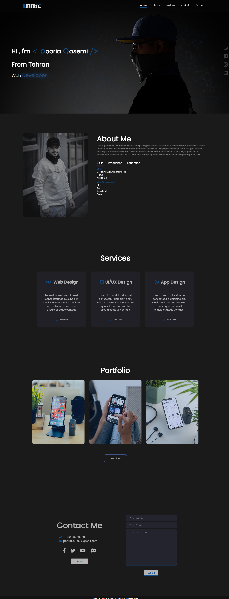

# Portfolio Website

[](https://p-limbo1996.github.io/Portfolio-js/)

## 📋 Introduction

This is a personal portfolio website created using JavaScript and CSS. The site is fully responsive, designed with media queries to adapt to various screen sizes, ensuring a great user experience across devices.

## 🚀 Live Demo

Check out the live version of the portfolio here: [Portfolio Website](https://p-limbo1996.github.io/Portfolio-js/)

## 🛠️ Features

- **Responsive Design**: Built with CSS and media queries to ensure compatibility across different screen sizes.
- **JavaScript**: Enhanced user interactions and dynamic content.
- **Portfolio Showcase**: Highlights projects and skills.
- **Contact Section**: Provides a way for visitors to reach out.

## 🧰 Technologies Used

- **HTML**: Structure of the website.
- **CSS**: Styling and layout.
- **JavaScript**: Interactive elements and functionality.
- **Media Queries**: For responsiveness across devices.

## 📦 Installation

To run this project locally, follow these steps:

1. Clone the repository:
    ```bash
    git clone https://github.com/p-Limbo1996/Portfolio-js.git
    ```

2. Navigate to the project directory:
    ```bash
    cd Portfolio-js
    ```

3. Open the `index.html` file in your preferred web browser:
    ```bash
    open index.html
    ```
    Or simply drag and drop the `index.html` file into your browser.

## 🖼️ Screenshots



## 📚 Notes

- This portfolio is continuously being updated with new projects and content.
- Feedback and suggestions are welcome!

## 🤝 Contributing

If you would like to contribute to this project, feel free to fork the repository, make your changes, and submit a pull request.
